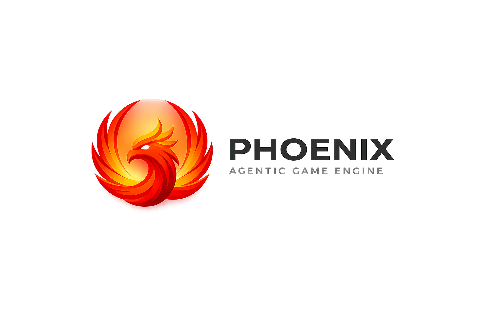

# Phoenix Agentic Game Engine

## Fork Notice (Phoenix Agentic Engine)

This repository is a fork of [Godot Engine](https://github.com/godotengine/godot). Phoenix Agentic Engine is an AI-native edition of the Godot editor focused on agentic workflows for game development. Planning docs live in [phoenix_docs](phoenix_docs), and implementation is designed to keep core engine changes minimal.

  

## What Is Phoenix

Phoenix is an agentic, IDE-style AI workspace inside Godot focused on pixel-art/retro game creation (for now), with first-class control over models, tools, and context. It treats AI as a core development tool that can plan, act, verify, and iterate inside the editor.

## What Makes Phoenix Different

Phoenix extends the editor with integrated agentic systems that can:

- Plan and decompose multi-step tasks (Ask / Plan / Agent modes)
- Coordinate specialized agents (code, art, audio, tools)
- Generate and edit GDScript, pixel art, and sound effects
- Modify scenes, resources, and assets directly in the editor
- Run and verify projects as part of an execution loop
- Present diffs, approvals, and audit logs for safe changes

Core engine systems such as rendering, physics, and platform support remain aligned with upstream Godot. Phoenix focuses on extending the editor layer, not rewriting engine fundamentals.

## Agentic Workflow Overview

Phoenix enables a workflow like:

1. User defines an intent or task
2. A planner produces a step-by-step plan
3. Specialized agents execute steps with approvals
4. Assets, scripts, and scenes are created or modified in-editor
5. Results are summarized and optionally committed

See [phoenix_docs/UX_ASSISTANT.md](phoenix_docs/UX_ASSISTANT.md) and [phoenix_docs/ARCHITECTURE.md](phoenix_docs/ARCHITECTURE.md) for the current UX and architecture plans.

## Open Source And Managed Services

Phoenix follows a dual-track model:

- Open source editor integration (MIT), including BYOK support
- Optional managed service for convenience, billing, and hosted models

The managed service backend is proprietary and not required to use Phoenix. See [phoenix_docs/MONETIZATION.md](phoenix_docs/MONETIZATION.md) for details.

## Integrations

Phoenix is designed to integrate with editor-native tools and external MCP servers for docs, audio, asset tooling, and project management. See [phoenix_docs/INTEGRATIONS.md](phoenix_docs/INTEGRATIONS.md) and [phoenix_docs/GLUE_ARCHITECTURE.md](phoenix_docs/GLUE_ARCHITECTURE.md) for the current inventory and planned integrations.

## 2D and 3D cross-platform game engine

**[Godot Engine](https://godotengine.org) is a feature-packed, cross-platform
game engine to create 2D and 3D games from a unified interface.** It provides a
comprehensive set of [common tools](https://godotengine.org/features), so that
users can focus on making games without having to reinvent the wheel. Games can
be exported with one click to a number of platforms, including the major desktop
platforms (Linux, macOS, Windows), mobile platforms (Android, iOS), as well as
Web-based platforms and [consoles](https://godotengine.org/consoles).

## Free, open source and community-driven

Godot is completely free and open source under the very permissive [MIT license](https://godotengine.org/license).
No strings attached, no royalties, nothing. The users' games are theirs, down
to the last line of engine code. Godot's development is fully independent and
community-driven, empowering users to help shape their engine to match their
expectations. It is supported by the [Godot Foundation](https://godot.foundation/)
not-for-profit.

Before being open sourced in [February 2014](https://github.com/godotengine/godot/commit/0b806ee0fc9097fa7bda7ac0109191c9c5e0a1ac),
Godot had been developed by [Juan Linietsky](https://github.com/reduz) and
[Ariel Manzur](https://github.com/punto-) for several years as an in-house
engine, used to publish several work-for-hire titles.

## Getting the engine

### Binary downloads

Official binaries for the Godot editor and the export templates can be found
[on the Godot website](https://godotengine.org/download).

### Compiling from source

[See the official docs](https://docs.godotengine.org/en/latest/engine_details/development/compiling)
for compilation instructions for every supported platform.

## Community and contributing

Godot is not only an engine but an ever-growing community of users and engine
developers. The main community channels are listed [on the homepage](https://godotengine.org/community).

The best way to get in touch with the core engine developers is to join the
[Godot Contributors Chat](https://chat.godotengine.org).

To get started contributing to the project, see the [contributing guide](CONTRIBUTING.md).
This document also includes guidelines for reporting bugs.

## Documentation and demos

The official documentation is hosted on [Read the Docs](https://docs.godotengine.org).
It is maintained by the Godot community in its own [GitHub repository](https://github.com/godotengine/godot-docs).

The [class reference](https://docs.godotengine.org/en/latest/classes/)
is also accessible from the Godot editor.

We also maintain official demos in their own [GitHub repository](https://github.com/godotengine/godot-demo-projects)
as well as a list of [awesome Godot community resources](https://github.com/godotengine/awesome-godot).

There are also a number of other
[learning resources](https://docs.godotengine.org/en/latest/community/tutorials.html)
provided by the community, such as text and video tutorials, demos, etc.
Consult the [community channels](https://godotengine.org/community)
for more information.

